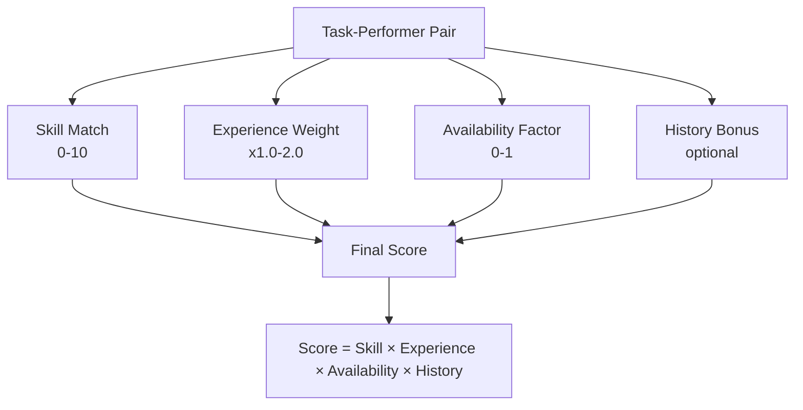
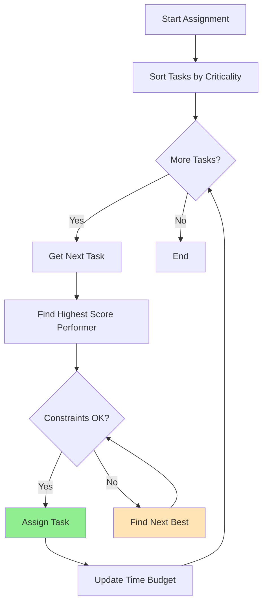
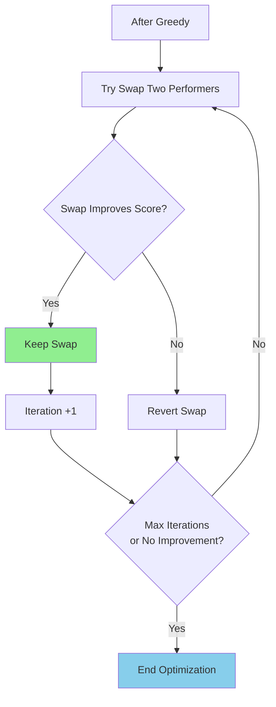
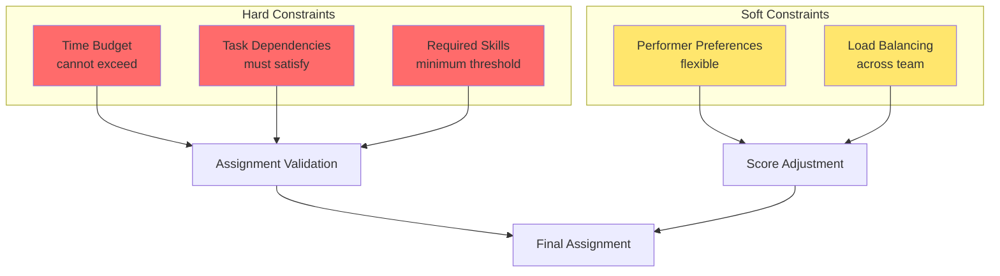
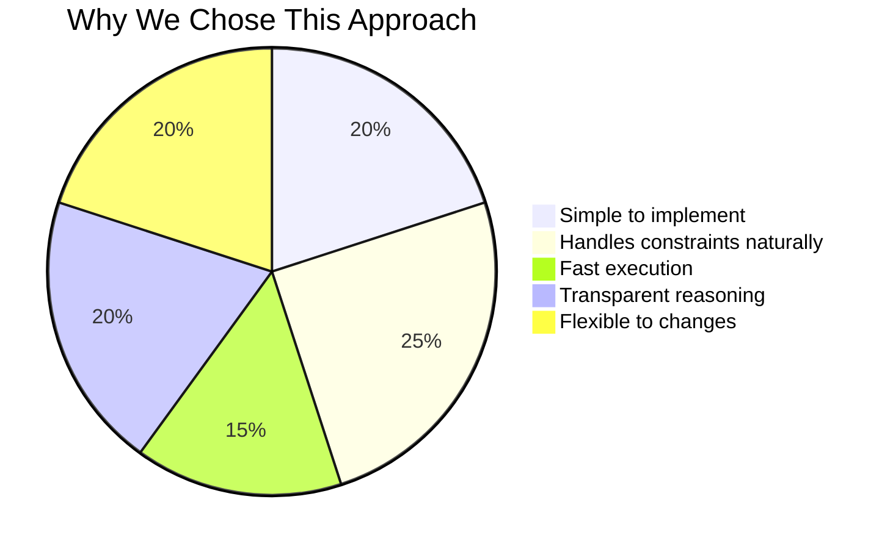
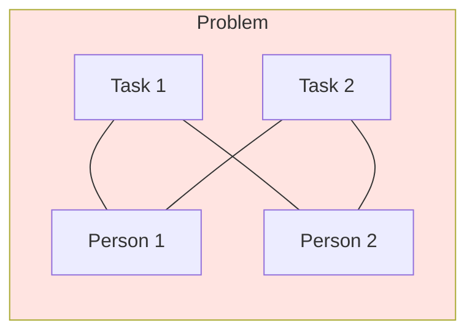
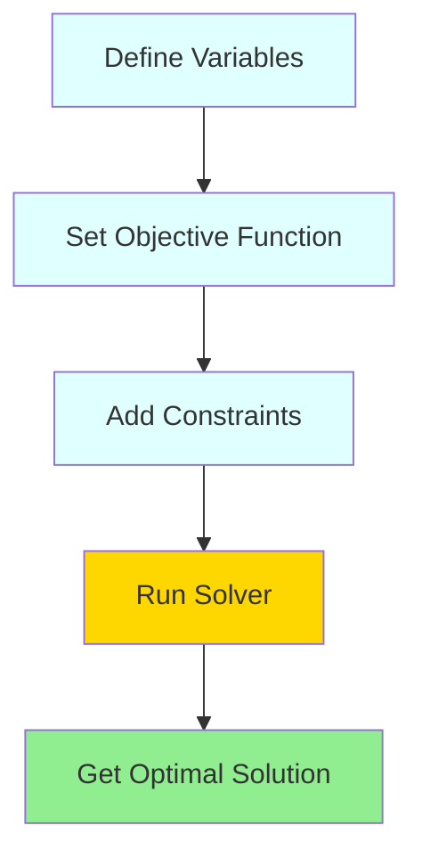
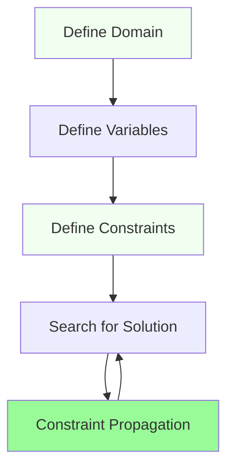
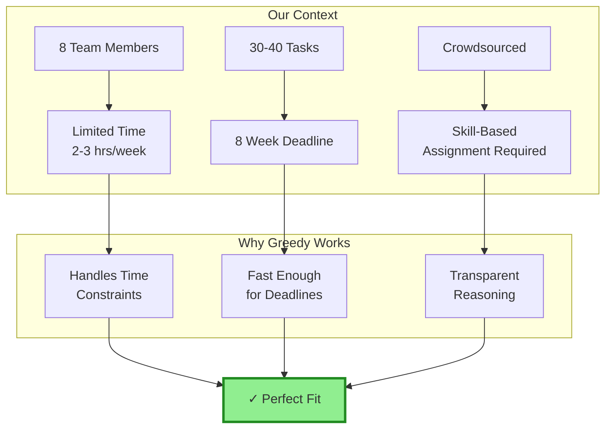

# ADR 002: Resource-Task Matching Algorithm for PM Agent

## Status
Proposed

## Date
2026-06-29

## Context
The SALSA project requires a PM (Project Manager) Agent to perform intelligent task assignment based on participant skills and time constraints. The project involves:
- 8 team members with limited time budgets (2-3 hours/week)
- 8-week deadline
- Crowdsourced contribution model
- Skill-based assignment requirement (not pull model)

We need to choose an optimal algorithm for matching tasks to performers.

## Decision
We will use a **Greedy Algorithm with Local Search Optimization** for resource-task matching.

---

## Algorithm Design

### 1. Score Calculation

Each task-performer pair receives a score based on four factors:



**Score Formula:**
```
Final Score = Skill_Match × Experience_Weight × Availability_Factor × History_Bonus
```

### 2. Greedy Assignment Process



### 3. Local Search Optimization



### 4. Constraints Handling



---

## Comparison: Pros and Cons

### 1. Greedy + Local Search (Chosen) ✓



**Pros:**
- ✅ Simple to implement in prompt-based AI agent
- ✅ Handles real-world constraints naturally (time budget, dependencies)
- ✅ Fast execution (O(n²) for n tasks × m performers)
- ✅ Provides "good enough" solutions for 30-40 tasks
- ✅ Transparent reasoning process (AI can explain each decision)
- ✅ Flexible to add new constraints without algorithm redesign

**Cons:**
- ⚠️ May miss global optimum (local vs global maximum)
- ⚠️ Sensitive to task ordering
- ⚠️ No formal guarantee of optimality
- ⚠️ Requires careful constraint definition

---

### 2. Hungarian Algorithm



**Pros:**
- ✅ Guarantees optimal solution for 1-to-1 assignment
- ✅ Well-studied, proven algorithm
- ✅ Polynomial time complexity O(n³)

**Cons:**
- ❌ Requires 1-to-1 mapping (participants can do multiple tasks)
- ❌ Doesn't handle time budget constraints natively
- ❌ Doesn't account for task dependencies
- ❌ Doesn't support soft preferences

---

### 3. Linear Programming (Simplex)



**Pros:**
- ✅ Handles all types of constraints mathematically
- ✅ Guarantees optimal solution
- ✅ Flexible objective function

**Cons:**
- ❌ Complex to implement in AI agent
- ❌ Requires numerical solver
- ❌ Overkill for small projects (~30 tasks)
- ❌ Less transparent for AI reasoning

---

### 4. CSP Solver



**Pros:**
- ✅ Natural constraint modeling
- ✅ Built-in constraint propagation
- ✅ Declarative specification

**Cons:**
- ❌ Requires specialized libraries
- ❌ May be slow for large search spaces
- ❌ Complex setup for simple use cases
- ❌ Less intuitive for prompt-based implementation

---

## Summary Comparison Table

```mermaid
gantt
    title Algorithm Complexity Comparison
    dateFormat X
    axisFormat %s
    
    section Greedy + Local Search
    Implementation    : 0, 2
    Execution Time    : 0, 3
    Constraint Handling: 0, 2
    
    section Hungarian
    Implementation    : 0, 4
    Execution Time    : 0, 5
    Constraint Handling: 0, 8
    
    section Linear Programming
    Implementation    : 0, 7
    Execution Time    : 0, 6
    Constraint Handling: 0, 2
    
    section CSP Solver
    Implementation    : 0, 6
    Execution Time    : 0, 7
    Constraint Handling: 0, 3
```



| Algorithm | Optimal | Handles Constraints | Implementation Complexity | Best For |
|-----------|---------|-------------------|-------------------------|----------|
| **Greedy + Local Search** | Near-optimal | ✓ Easy | Low | Our project ✓ |
| Hungarian Algorithm | ✓ Yes | ✗ Hard | Medium | 1-to-1 simple matching |
| Linear Programming | ✓ Yes | ✓ Easy | High | Large complex projects |
| CSP Solver | ✓ Yes | ✓ Easy | High | Academic/Research |

---

## Visual: Why Greedy + Local Search for Our Project?



---

## Consequences

### Positive 🎉
- Simple to implement in prompt-based AI agent
- Handles real-world constraints naturally
- Fast execution (O(n²) for n tasks × m performers)
- Provides "good enough" solutions for 30-40 tasks

### Negative ⚠️
- May miss global optimum (local vs global maximum)
- Sensitive to task ordering
- No formal guarantee of optimality

---

## Implementation Notes

The PM Agent should:

1. **Parse** member profiles from `.members/` directory
2. **Extract** skills, time budgets, experience levels
3. **Build** task requirements from WBS (Work Breakdown Structure)
4. **Calculate** scores using the formula above
5. **Run** greedy assignment
6. **Apply** local search optimization
7. **Output** assignment map with rationale

---

## References
- Hungarian Algorithm: Kuhn (1955)
- Local Search: Glover & Kochenberger (2003)
- TF-IDF: Salton & Buckley (1988)
